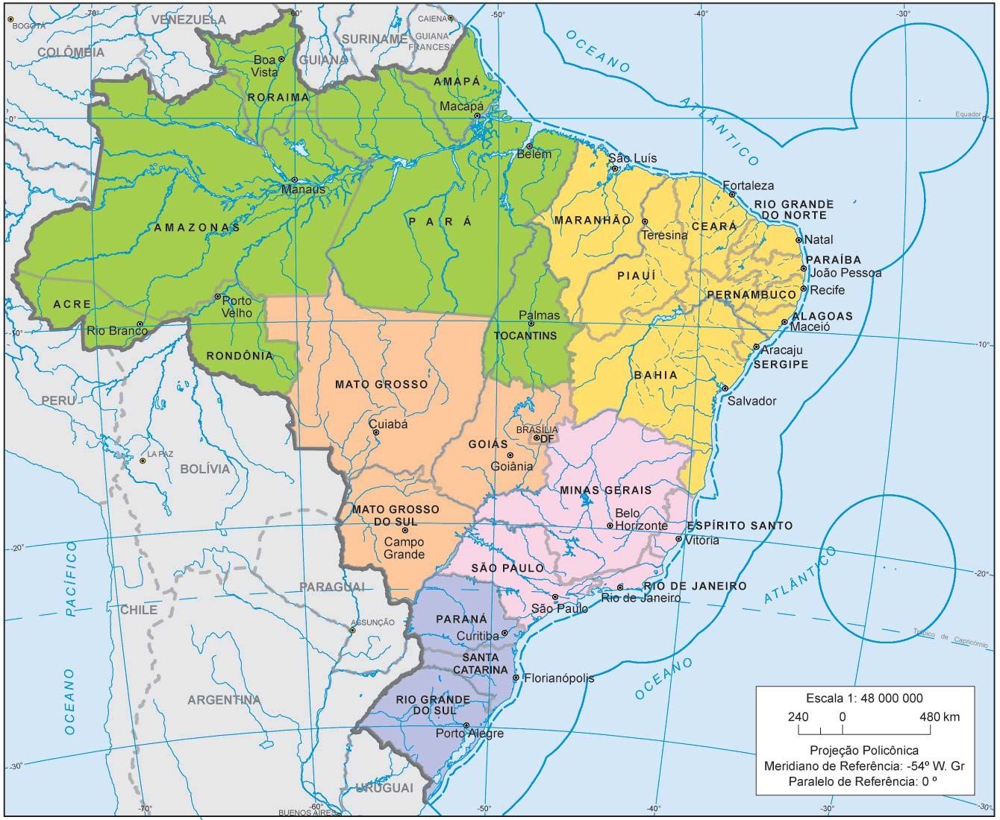

# Formulario de Cidades e Estados do Brasil utilizando API do IBGE

Formulário simples para reutilizar em outros códigos, sem licença até onde entendo, utilizando a API do IBGE para preencher as informações.

